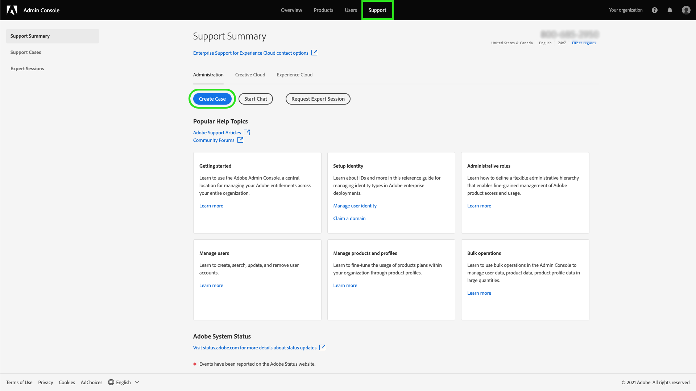
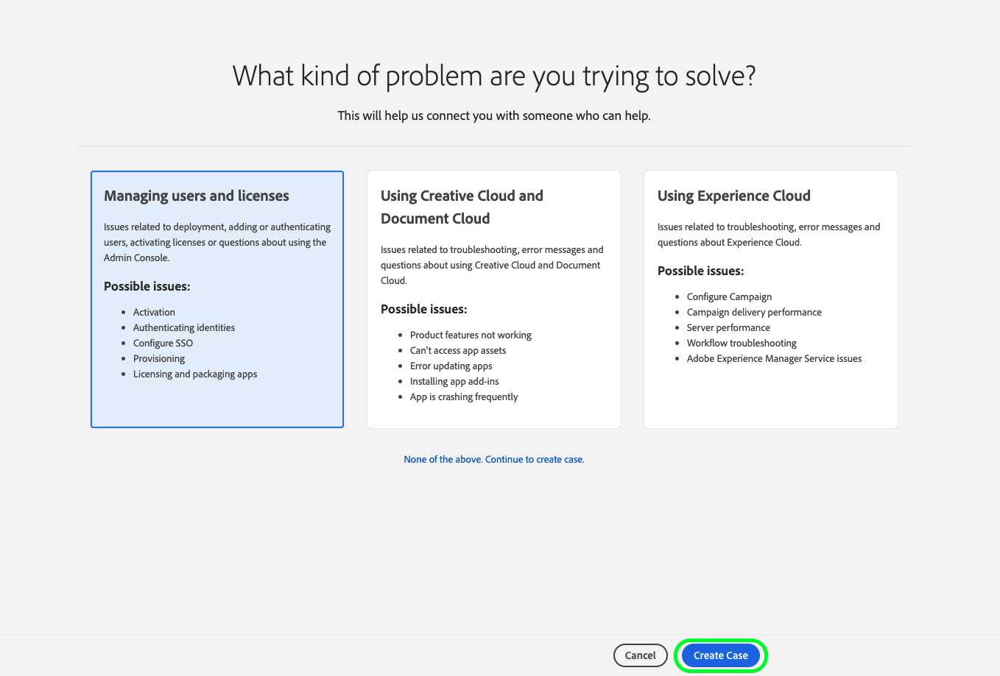
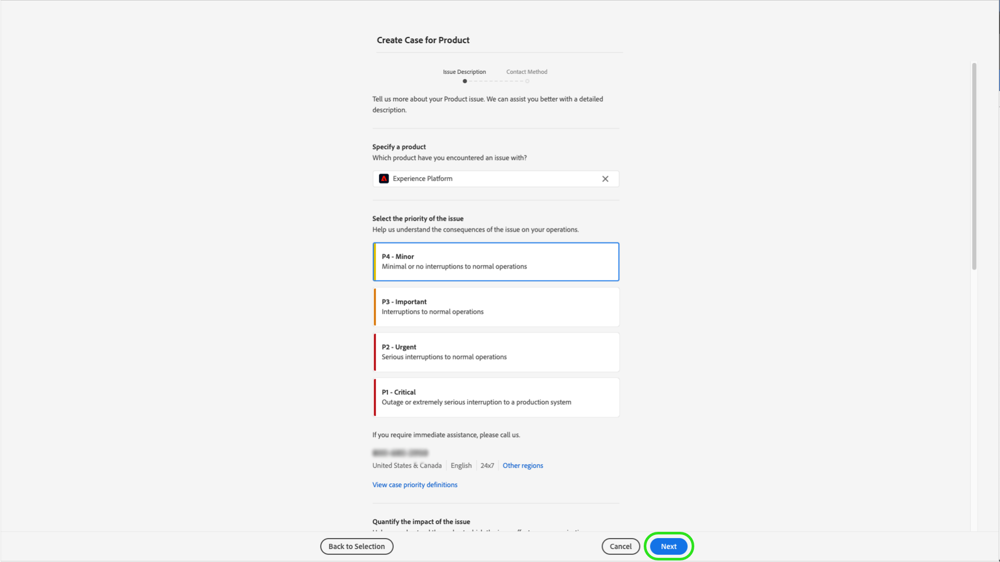
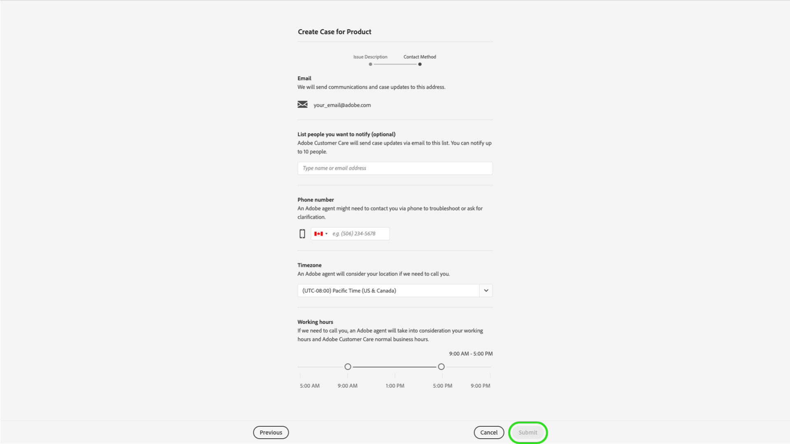

# New Adobe Customer Support Experience

## Admin Console Support Tickets

We are excited to announce the Adobe Customer Support Experience is live as of May 11th 2020!

Support Tickets are now able to be submitted via the [Admin Console](https://adminconsole.adobe.com/). For instructions on how to submit a support ticket, review the section for [submitting a support ticket](#submit-ticket).

As previously shared, we are working to improve how you interact with Adobe Customer Support, starting with Adobe Experience Manager and Campaign products. Our vision is to streamline the support experience by moving to a single entry point, using the Adobe Admin Console. Once live, your organization will be able to easily access Adobe Customer Support; have greater visibility into your service history via a common system across products; and request help via phone, web, and chat through a single portal.

## How to submit an Admin Console support ticket {#submit-ticket}

In order to submit a support ticket in [Admin Console](https://adminconsole.adobe.com/), you need to have the Support admin role assigned by a System Administrator. Only a System Administrator in your organization can assign this role. Product, Product Profile, and other administrative roles cannot assign the Support admin role and are unable to view the **[!UICONTROL Create Case]** option used to submit a support ticket. For more information, visit the [enterprise and teams customer care](https://helpx.adobe.com/enterprise/using/support-and-expert-services.html) documentation.

### Assign the Support admin role

The support admin role is a non-administrative role that has access to support-related information. Support admins can view, create, and manage issue reports.

To assign the Support admin role, follow the [edit enterprise admin role](https://helpx.adobe.com/enterprise/using/admin-roles.html#add-admin-teams) instructions in the administrative roles documentation. Note that only a system administrator for your organization can assign this role. For more information on administrative hierarchy, visit the [administrative roles](https://helpx.adobe.com/enterprise/admin-guide.html/enterprise/using/admin-roles.ug.html) documentation.

### Create a support ticket with Admin Console

To create a ticket using [Admin Console](https://adminconsole.adobe.com/), select the **[!UICONTROL Support]** tab located in the top navigation. The [!UICONTROL Support Summary] page appears. Next, select the **[!UICONTROL Create Case]** option.

>[!TIP]
>
> If you are unable to see the **[!UICONTROL Create Case]** option or the **[!UICONTROL Support]** tab, you need to contact a System Administrator to assign the Support admin role.

A dialog appears allowing you to select an issue type. Select the issue type that best describes your problem or question, then select **[!UICONTROL Create Case]** in the bottom-right.

The **[!UICONTROL Create Case ]** dialog appears. You are asked to provide some information such as the product, priority, description, and attach any screenshots to help describe the issue. Select **[!UICONTROL Next]** to continue.

>[!NOTE]
>
> If the issue results in outages or extremely serious interruptions to a production system, a phone number is provided for immediate assistance.

The next page allows you to fill in contact information and provide the best time for Adobe Customer Support to contact you. Once complete, select **[!UICONTROL Submit]** in the bottom-right and your ticket is sent to Adobe Customer Support.

## What About the Legacy Systems?

New Tickets/Cases will no longer be able to be submitted in leacy systems as of May 11th.  The [Admin Console](https://adminconsole.adobe.com/) will be used to submit new tickets/cases.

### Existing Tickets/Cases

* Between May 11th and May 20th the legacy systems will remain available to work existing tickets/cases to completion.
* Beginning May 20th the support team will migrate remaining open cases from the legacy systems to the new support experience.  You will receive an email notification regarding how to contact support to continue to work these cases.

### Case History

Closed case histroy will be visible to the Adobe support personnel.  If you need assistance regarding a closed case, please see the Need Help? section below.

## Need Help?

After Go-Live, if you encounter issues and are unable to login to the new tool, you have the following options:

### Option 1: Submit a Ticket

Contact us by logging a ticket from [Experience League](https://experienceleague.adobe.com/?support-solution=General#support) and include:

* Contact details: Name, email address, phone
* Company Name
* Adobe Product Owned
* Issue Priority
* Brief description of the issue

### Option 2: Prior to May 11th

Prior to May 11th you may still use the legacy [Campaign Extranet](https://support.neolane.net/webApp/extranetLogin) or [Experience Manager Daycare](https://daycare.day.com/home.html) case management systems.  After May 11th you will be redirected to the [Admin Console](https://adminconsole.adobe.com/) as these systems will not be accepting new cases.

For questions regarding this email, please contact us by logging a ticket from [Experience League](https://experienceleague.adobe.com/?support-solution=General#support).
